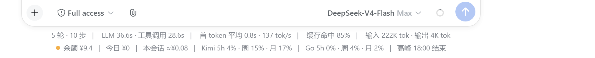
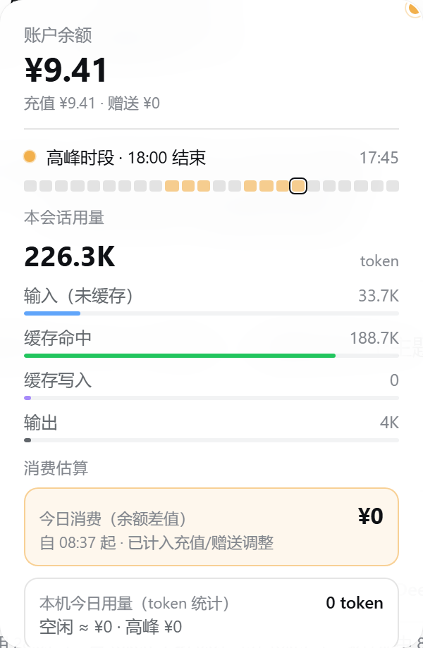
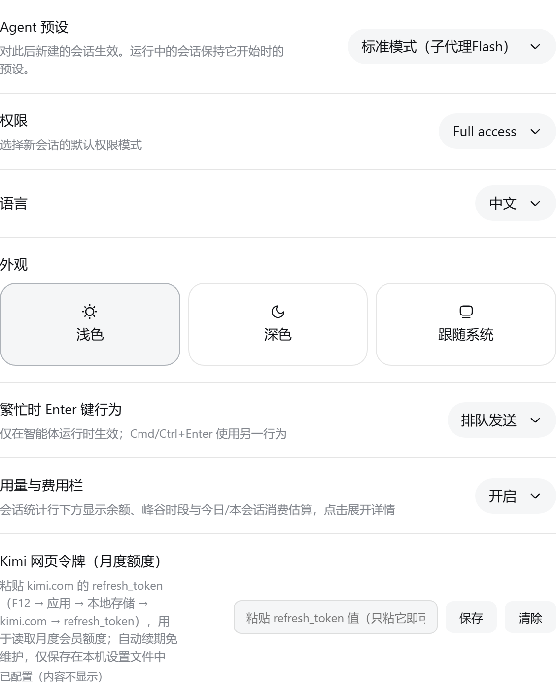

# dsh-usage-footer

> 本仓库是 [1514100951/dsh-usage-footer](https://github.com/1514100951/dsh-usage-footer) 的 fork：浏览器端从「右下角悬浮金币按钮」改为「会话统计行下方的内嵌计费行」（余额 / 今日 / 本会话 / Kimi 配额 / Go 配额 / 峰谷时段），详情面板改为从计费行上方展开，并新增 Kimi Coding Plan 配额、Kimi 月度会员配额、opencode Go 订阅配额等数据源。

DSH（DeepSeek Harness）Web 界面「用量与费用」插件（独立项目），包含两个包：

| 包 | 角色 | 入口 |
|---|---|---|
| `dsh-usage-status` | 宿主插件：注册 `GET /usage-status` 路由（查询 DeepSeek 余额 API、Kimi / opencode 配额接口），并注册 `usage-footer` 设置命名空间作为开关门控 | `lib/index.js` |
| `dsh-client-ui-usage-footer` | 浏览器插件：在会话统计行（`conversation.composer.dock`）下方渲染一行计费信息，点击展开用量面板；并在 **设置 → 通用** 增加「用量与费用栏」开关与 Kimi 令牌配置 | `lib/client.js`（自包含 bundle） |

## 截图

会话视图底部（会话统计行与计费行，位于输入框上方）：



计费行特写：


详情面板（点击计费行展开）：



设置页（开关 + Kimi 令牌字段）：



## 功能

- **计费行（会话统计行下方）**：内嵌一行计费信息——`余额 ¥xx | 今日 ¥xx | 本会话 ≈¥xx | Kimi 5h xx% · 周 xx% · 月 xx% | Go 5h xx% · 周 xx% · 月 xx% | 高峰 xx:xx 结束`，行首圆点指示当前时段——绿=空闲、琥珀=高峰（呼吸动画）、红=余额查询失败；样式与宿主会话统计行一致（居中、12px、`|` 分隔）
- **详情面板**（120ms 延迟出现、260ms 宽容关闭；点击可钉住，点外部/Esc 关闭；自计费行上方展开）：
  - **账户余额**：官方 API `GET https://api.deepseek.com/user/balance`（每 60 秒刷新，点击"更新"手动刷新），含充值/赠送拆分
  - **峰谷时段**：按北京时间实时判定高峰/空闲，显示当前时刻与下次切换时间，并附 24 小时峰谷条（高峰 9:00-12:00 / 14:00-18:00，当前小时高亮）
  - **本会话用量**：累计 token + 输入（未缓存）/缓存命中/缓存写入/输出 四项分条
  - **今日消费（余额差值，官方口径）**：当天首次查询时把余额快照写入 `$DSH_HOME/usage-footer-balance-baseline.json`，之后每次查询用「当日快照 − 当前余额」算出今日真实消费（已对充值/赠送做修正运算，日切自动重锚）；余额结算有延迟，且不含当日首次查询前产生的消耗
  - **本机今日用量（token 统计）**：按会话去重、**按模型分桶**累计本机今日产生的 token，显示 token 数与按各模型峰谷价目估算的金额（空闲/高峰两档），日切自动清零，存于浏览器 localStorage（`dsh-usage-footer.today.v2`，自动迁移 v1）；这是本机观测统计，**非官方账单**
  - **消费估算（本会话）**：token 数 × 当前会话所用模型的 DeepSeek 峰谷定价（v4-pro / v4-flash 价目表，未知模型回退 v4-pro），空闲/高峰两档并排；价目表由宿主插件从**官方定价页自动同步**（每 12 小时重新检查，解析失败回退内置表），并**按生效日期自动切换平价表/峰谷表**（峰谷价 2026-08-17 00:00 起生效，之前按平价表计费），面板注明价格来源与当前计费档
  - **本月账户用量**（可选）：配置 `DEEPSEEK_PLATFORM_TOKEN`（platform.deepseek.com 浏览器登录态 `userToken`）后显示
- **Kimi Code 配额（Coding Plan）**：从官方 usages 接口读取 5 小时 / 周 / 月三档百分比与加油包余额，直接显示在计费行（`Kimi 5h 3% · 周 15% · 月 17%`），无需任何配置
- **Kimi 月度会员配额**：在 **设置 → 通用 → Kimi 网页令牌（月度额度）** 粘贴 kimi.com 的 `refresh_token`（F12 → 应用 → 本地存储 → kimi.com）后，通过 kimi.com 订阅页接口抓取月度会员额度（已用百分比 + 重置日期），令牌自动续期免维护，仅保存在本机设置文件
- **opencode Go 订阅配额**：读取 Go 订阅的 5 小时滚动 / 周 / 月百分比，同样显示在计费行（`Go 5h 0% · 周 4% · 月 2%`）
- **自助开关**：设置 → 通用 → 「用量与费用栏」开启/关闭，实时生效；关闭后停止轮询、服务端路由拒绝查询
- 视觉：毛玻璃面板（backdrop-blur + 半透明菜单底色）、表格数字（tabular-nums）、细线分隔、入场位移+缩放动画，全部使用宿主 `--dsw-*` 设计令牌，自动适配明暗主题

> 说明：账户级"今日/本月用量与消费"的官方数据源（platform.deepseek.com 私有接口）需要浏览器登录态 `userToken`，配置 `DEEPSEEK_PLATFORM_TOKEN` 后可用；未配置时"今日消费"来自余额差值快照、"本机今日用量"为本机观测估算。

## 安装方法（任意机器通用）

### 1. 前置条件

- 已安装并运行 `dsh web`（DeepSeek Harness 的 Web 界面）
- 凭证中已配置 `DEEPSEEK_API_KEY`（写入 `$DSH_HOME/.credentials.yaml` 或环境变量，格式 `DEEPSEEK_API_KEY: sk-...`）
- 可选：`DEEPSEEK_PLATFORM_TOKEN`（platform.deepseek.com 浏览器登录态的 `userToken`），用于显示本月账户用量
- 宿主插件依赖 `@deepseek-ai/schemastery`：在本仓库根目录执行一次 `pnpm install`（或把本机 DSH 模块目录链接到本仓库的 `node_modules/`）

### 2. 把两个包放进 DSH 的模块目录

DSH 的宿主 Loader 与浏览器模块扫描器都按**包名**从 `$DSH_HOME/profiles/node_modules`（模块回退目录）解析插件。将本仓库的两个包目录**链接或复制**到该目录下：

- `dsh-usage-status` → `$DSH_HOME/profiles/node_modules/dsh-usage-status`
- `dsh-client-ui-usage-footer` → `$DSH_HOME/profiles/node_modules/dsh-client-ui-usage-footer`

macOS / Linux：

```bash
ln -s <本仓库路径>/packages/dsh-usage-status $DSH_HOME/profiles/node_modules/dsh-usage-status
ln -s <本仓库路径>/packages/dsh-client-ui-usage-footer $DSH_HOME/profiles/node_modules/dsh-client-ui-usage-footer
```

Windows（管理员 PowerShell，用 junction 链接后改本仓库代码即生效）：

```powershell
New-Item -ItemType Junction -Path "$env:USERPROFILE\.dsh\profiles\node_modules\dsh-usage-status"           -Target "<本仓库路径>\packages\dsh-usage-status"
New-Item -ItemType Junction -Path "$env:USERPROFILE\.dsh\profiles\node_modules\dsh-client-ui-usage-footer" -Target "<本仓库路径>\packages\dsh-client-ui-usage-footer"
```

直接复制目录也可以，但改代码后需要重新复制。

### 3. 在 Web profile 的组合里注册两行

编辑你的 web profile 补丁文件 `$DSH_HOME/profiles/web/cordis.patch.yml`，追加：

```yaml
- insert:
    - id: usage-status
      name: dsh-usage-status

    - id: ui-usage-footer
      name: dsh-client-ui-usage-footer
```

该文件被运行中的 `dsh web` 热监听，保存后宿主行自动挂载；随后**刷新浏览器页面**即可在会话统计行下方看到计费行。想完全卸载时，把这两行置 `disabled: true`。

## 修改后如何生效

- **客户端 bundle（UI）**：改 `packages/dsh-client-ui-usage-footer/lib/client.js` 后，**刷新浏览器页面**即可（bundle 按请求实时读取、no-cache）。
- **宿主插件（API 路由 / 设置注册）**：改 `packages/dsh-usage-status/lib/index.js` 后，**重启 `dsh web`**（宿主模块按进程缓存，无热重载）。

## 本地检查

```bash
pnpm run check        # 语法检查两个入口文件
node test/baseline.test.mjs   # 余额基线/今日消费计算测试
```

## 设置持久化

开关状态写入两处并保持一致：浏览器 `localStorage`（`dsh-usage-footer.enabled`，无需重启即可用）与宿主设置文档（重启一次 `dsh web` 后生效，存于 `settings.yaml` 的 `usage-footer` 段）。Kimi 令牌（refresh_token）只写入本机设置文件，不进入浏览器存储。

## 安全说明

- 本项目代码不含任何密钥；API Key 始终通过 DSH 凭证服务在宿主侧解析
- `GET /usage-status` 路由仅接受本机回环（loopback）请求，局域网访问返回 403
- Kimi `refresh_token` 仅保存在本机设置文件（`settings.yaml` 的 `usage-footer` 段），界面中只显示"已配置"，不回显内容
